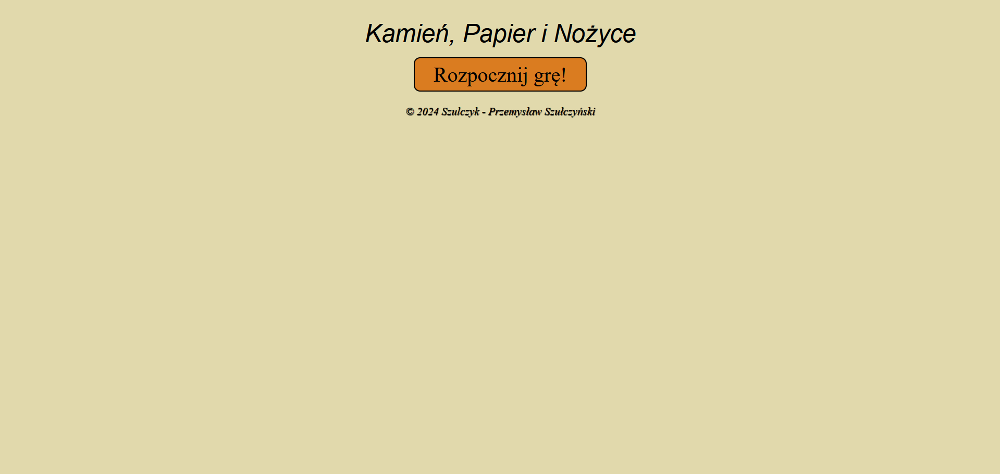
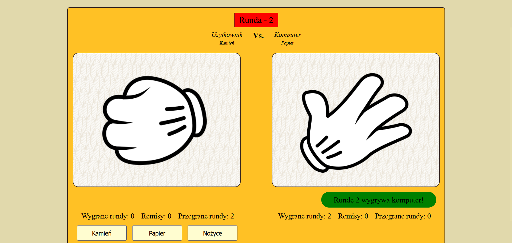
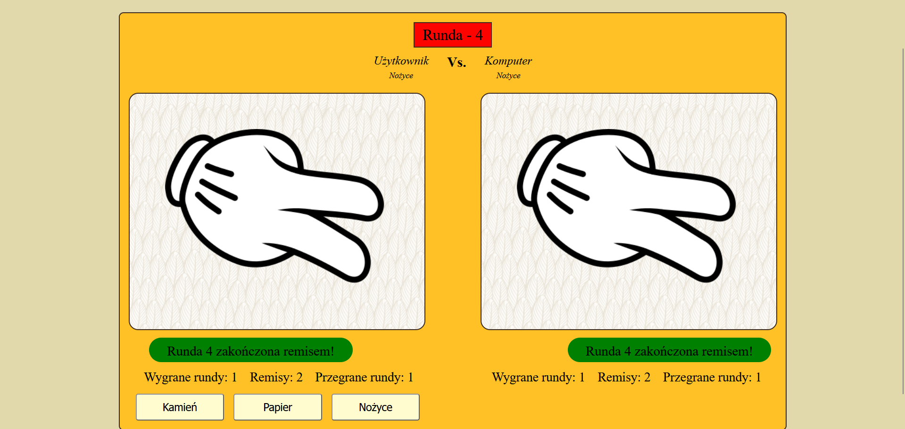
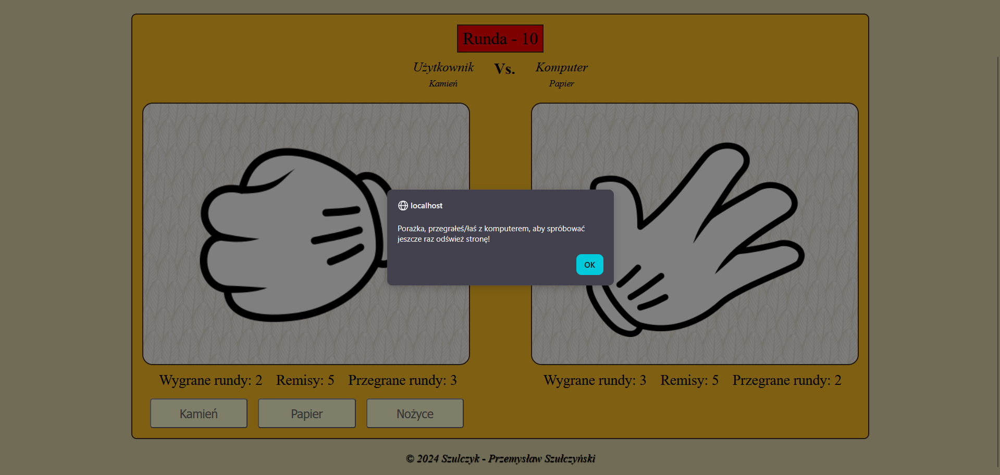

# ***[Projekt Do trzech](https://szulczyk.pl/projekt-6/do-trzech)***

## 🖼️ ***Zrzuty ekranu***

 

## 📄 ***Opis projektu***
### ✅ *Projekt zakończony dnia 17.12.2024*
### *Do trzech to prosta gra w kamień, papier i nożyce, w której rywalizujesz z komputerem do momentu zdobycia trzech wygranych rund. Każde starcie jest unikalne, ponieważ gracz wybiera swój ruch przed decyzją systemu. W trakcie rozgrywki na bieżąco wyświetlane są wyniki poszczególnych rund oraz ogólne statystyki starcia. Całość kończy się czytelnym komunikatem podsumowującym finałowe rezultaty całej gry.*

 

## 🛠️ ***Stack projektu***
- ### *Frontend*
  - ### *HTML5*
  - ### *CSS3*
  - ### *JQuery*
- ### *Backend*
  - ### *Brak użytych technologii*
- ### *Bazy danych*
  - ### *Brak użytych technologii*

 

## 📌 ***Podsumowanie projektu***
### 🎯 *Głównym zadaniem projektu było stworzenie prostej, nieprzewidywalnej gry, której losowość gwarantuje unikalny przebieg każdej rozgrywki. Projekt ten pozwolił mi również na przećwiczenie biblioteki JQuery w większej skali, pokazując przy tym moje umiejętności programistyczne.*
### 💡 *Czego się nauczyłem:*
- ### *Większy skok w JQuery - porządnie przetestowałem tę bibliotekę w boju i czuję, że pisanie w niej stało się dla mnie o wiele bardziej naturalne.*
- ### *Estetyka na ekranie - zamiast rzucać elementy byle gdzie, przysiadłem do układu strony i stylów, żeby całość wyglądała spójnie oraz profesjonalnie.*
- ### *Ogarnięcie układu strony - w praktyce przećwiczyłem pozycjonowanie kontenerów, dzięki czemu wszystko na ekranie leży dokładnie tam, gdzie powinno.*
- ### *Pierwsze starcie z losowością - po raz pierwszy wdrożyłem w grze logikę opartą na losowych wynikach, co było świetnym treningiem logicznego myślenia.*
- ### *Płynność i dynamika - ogarnąłem animacje w JQuery, dzięki czemu idealnie zgrywają się z akcją na ekranie i dodają grze charakteru.*

 

## 📨 ***Kontakt***
- ### 📧 *E-mail -* przemo.ppk@gmail.com
- ### 💻 *Discord -* darkcoder97